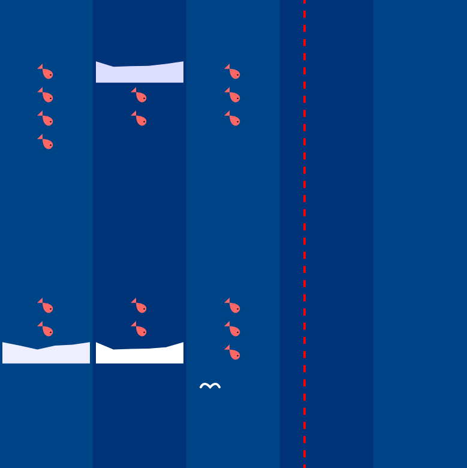

# row wrap;

[Click to play!](https://justinyaodu.com/row-wrap)

> After all, why not? Why shouldn't I use the DOM as a game engine?

`row wrap;` is a game about eating fish and avoiding icebergs, written in HTML/CSS/vanilla JS. It uses the wrapping behavior of flexboxes as a game mechanic.
